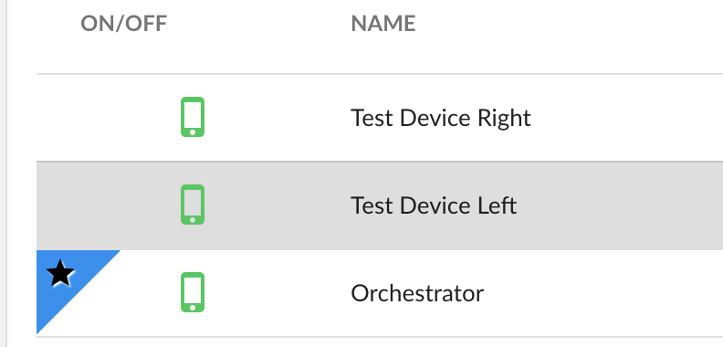
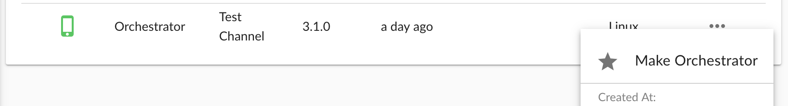

# Orchestrator Adapter

It's a library for communication between devices in a same shop.

### What is Orchestrator?

Orchestrator is a special device in the shop, which is responsible for the communication between devices. The orchestrator device must have websocket server abilities, therefore older WebOS devices cannot be orchestrator.

Orchestrator device must be explicitly chosen in the shop detail page. If there is no orchestrator chosen or the orchestrator device is offline, this class will not work.

### How to choose Orchestrator?

Go to `Shops` page and choose your shop. In `Devices` tab, orchestrator device is shown with blue star marker (if there is any) which can be seen below.



To set a device as orchestrator, hover the `...` icon and click `Make Orhestrator` button.



> As previously mentioned, if the device does not support being orchestrator, this button will be hidden.


## API Reference

### `new OrchestratorAdapter(options)`

Options|Type|Description
----|----|-----------
`options.clientName`|string|Unique client identifier name. If there is already a connection with that identifier, future requests with the same id will be rejected.
`options.roomIdentifier`|string|The devices that joined in a same room can communicate each other.
`options.syncEngine`|string|Only allowed value for now: `generic`

Creates a new instance of Orchestrator Adapter.

```js
var orchestrator = new OrchestratorAdapter({
    clientName: 'device-' + omma.device.uuid,
    roomIdentifier: 'room1',
    syncEngine: 'generic'
});

// Setup a connection handler
orchestrator.onConnected = function() {
    console.log('Connected to orchestrator');
};

// Try to connect
orchestrator.connect();
```

### `OrchestratorAdapter.prototype.connect()`

Tries to connect to orchestrator.

### `OrchestratorAdapter.prototype.disconnect()`

Disconnects from orchestrator.

### `orchestratorAdapter.onConnected`

A function will be executed when connected to orchestrator.

### `orchestratorAdapter.onDisconnected`

A function will be executed when disconnected from orchestrator.

```js
orchestrator.onDisconnected = function() {
    console.log('Oops, disconnected from orchestrator');
};
```

### `OrchestratorAdapter.prototype.broadcast(eventName, data)`

- eventName: `string` Name of the broadcasting event
- data: `any` Optional payload data

Broadcasts a message to all devices in the room.

> Please note that the broadcaster will also recieve the message.

### `OrchestratorAdapter.prototype.sendTo(destination, eventName, data)`

- destination: `string` Destination client identifier (specified as `clientName` in the constructor options).
- eventName: `string` Name of the event
- data: `any` Optional payload data

Sends a message to specific client in the room.

### `OrchestratorAdapter.prototype.on(eventName, handler)`

- eventName: `string` Name of the event
- handler: `Function(payload?: any)` Handler function.

Listens for incoming events.

### Real-life example

> All the code below must run in `omma.ready(...)` handler.

> If you don't know how to differentiate devices with labels, please refer [making distiction with labels](README.md#making-distiction-with-labels).

```js
var orchestratorAdapter = new OrchestratorAdapter({
    clientName: 'device-' + device.uuid,
    roomIdentifier: 'room1',
    syncEngine: 'generic'
});

orchestratorAdapter.onConnected = function() {
    console.log('Device is connected');

    // If the device has `foo` label, broadcast a message
    if (omma.device.labels.indexOf('foo')) {
        orchestratorAdapter.broadcast('hello', { from: 'foo' });
    }
};

orchestratorAdapter.connect();

// Listen for hello events
orchestratorAdapter.on('hello', function(payload) {
    // All devices in `room1` will recieve this event (including foo)
    console.log(payload); // => { from: 'foo' }
});
```
