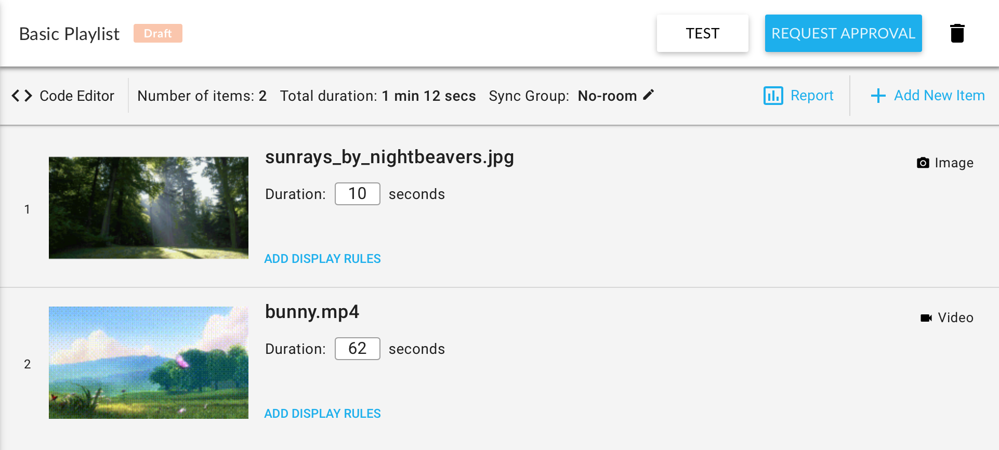
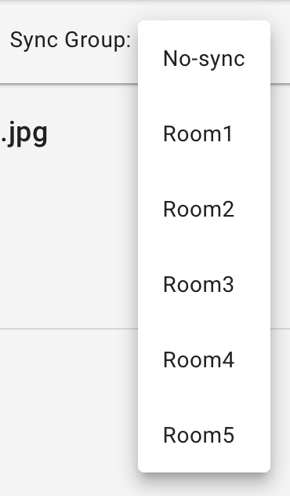

# Player

It's a built-in library to display a series of videos, images, websites in a playlist-like fashion. It's the backbone of the Omma's content editor.

If you create content and add some images and videos, you will see a screen something like this:



In this example, we have just one image and one video. If you click `Code Editor` button on the top left, you will see the `Player` class working underneath.

```js
var player = new Player({
    items: __PLAYER_ITEMS__,
    name: __PLAYER_ROOM__,
    engine: __PLAYER_ENGINE__,
    baseElement: document.querySelector('#player'),
    showDebugComponent: false
});

player
    .init()
    .then(function() {
        return player.start({from: 0});
    })
    .catch(function(err) {
        omma.logger.error('Could not start player', err.message);
    });
```

Let's walk through the code:
1. Create a player instance
2. Initialize it
3. Right after initialization, start playing from the beginning
4. If there is an error occurred while initialization or starting attempt, send an error log using omma content helper.

But there are 3 magic variables that we haven't mentioned: `__PLAYER_ITEMS__`, `__PLAYER_ROOM__`, `__PLAYER_ENGINE__`.

#### `__PLAYER_ITEMS__`

It's a magic variable referencing to an array of playlist items added in the GUI section of the content creator. As you can see from the image above, we have added an image item and a video item. Sample value for the playlist is:

```json
[
    {
        "type": "image",
        "duration": 10,
        "rules": {},
        "uuid": "3405b5f5-d414-4cd9-9c39-006ad22d49a0",
        "src": "file:///home/signalive/medias/809-uhd.png",
        "mediaId": 809
    },
    {
        "type": "video",
        "duration": 62,
        "rules": {},
        "uuid": "3a5c917a-b61b-46d2-817e-bb9037a5aeee",
        "src": "file:///home/signalive/medias/632.mp4",
        "mediaId": 632,
        "maxDuration": 62
    }
]
```

You can see more information about playlist item objects below.

#### `__PLAYER_ROOM__`

A magic variable is referencing to the value of `Sync Group` drop-down.



Its default value is `no-sync` but also be `room1`, `room2`...

#### `__PLAYER_ENGINE__`

A magic variable is indicating the engine type to be used in the player. When Sync Group is chosen as no-sync, the variable will be a 'playlist' otherwise it becomes `playlist-sync-start`. You can have more information about player engines below.

## API Reference

### `new Player(options)`

Options|Type|Description
----|----|-----------
`options.items`|PlaylistItem[]|Array of playlist items. PlaylistItem properties can be seen below.
`options.engine`|string|More information below. Avaliable values: `playlist`, `playlist-sync-start`.
`options.name`|string|Sync room name. If a sync engine is used, all devices with same room name (in a shop) will play their content in sync.
`options.baseElement`|Element?|Optional parent element to render into. If not specified, player will render in `document.body`.
`options.showDebugComponent`|boolean?|Optional flag to show debugger component.

Creates a new instance of Player.

#### `PlaylistItem` object properties

Properties|Type|Description
----|----|-----------
`type`|string|Avaliable values: `image`, `video`, `iframe`, `html`
`src`|string|- For `image` and `video` type: source file, can be `media://XXX` or any external URL <br/> - For `iframe` type: The URL of the page to embed <br/> - For `html` type: Encoded HTML code string (See: [he encoder/decoder](https://github.com/mathiasbynens/he))
`duration`|number|Display duration (in seconds)
`uuid`|string|Unique playlist item id

#### Supported engines
- **`playlist`**: Standart default engine. No syncing. Next item will be played right after the current one is finished.
- **`playlist-sync-start`**: When a device finishes displaying the current item, it will wait for a signal from the orchestrator to switch the next item. Orchestrator will wait for all devices in a room to finish displaying current item, then sends a signal to all of them.

> If there is no orchestrator in the shop, `playlist-sync-start` will be declined and the standard `playlist` engine will be used.

### `Player.prototype.init()` -> `Promise<null>`

Returns a promise to resolve. When it's resolved, completes the Player initialization and plays.

### `Player.prototype.start(options)` -> `Promise<null>`

- options.from: `number` Item index to be started from
- options.respectDateControl: `boolean?` Whether respect date/time display rules.

Starts playing. If the player is not initialized, it will be initialized automatically.

### `Player.prototype.stop()` -> `Promise<null>`

Stops the player.

## HTML PlaylistItem Custom Hooks

Player preloads the next item before displaying it (if it's possible). Therefore it needs to know whether the item is ready to be displayed. By default, HTML items are considered to be ready 100 ms after it's mounted to DOM.

For more advanced requirements, we provide some hook functions accessible under window.playlistItem.hooks.

### `playlistItem.hooks.preventAutoCall()`

If you are going to use custom hooks for your playlist item, the first thing you should do is calling this function. It prevents the item from automatically being considered as ready.

### `playlistItem.hooks.ready()`

Sends a message to the player that the item is ready to be displayed.

### `playlistItem.hooks.error()`

Sends a message to the player indicating that an error occurs.

### `playlistItem.hooks.ended()`

Sends a message to the player that the item is finished playing and the player should switch to next item.

### Displaying an image with custom hooks

```html
<div id="container"></div>

<script>
    // Inform the player that we're going to use custom hooks
    playlistItem.hooks.preventAutoCall();

    // Create an image element and set its source
    var image = new Image();
    image.src = "http://some.domain/path/to/image.jpg";

    image.onload = function() {
        // Image is loaded, append to container and send a message when it's ready
        document.getElementById('container').appendChild(image);
        playlistItem.hooks.ready();

        // Let's display it for 10 seconds
        setTimeout(function() {
            playlistItem.hooks.ended();
        }, 10000);
    };

    image.onerror = function() {
        // Something went wrong while loading image
        playlistItem.hooks.error();
    };
</script>
```
